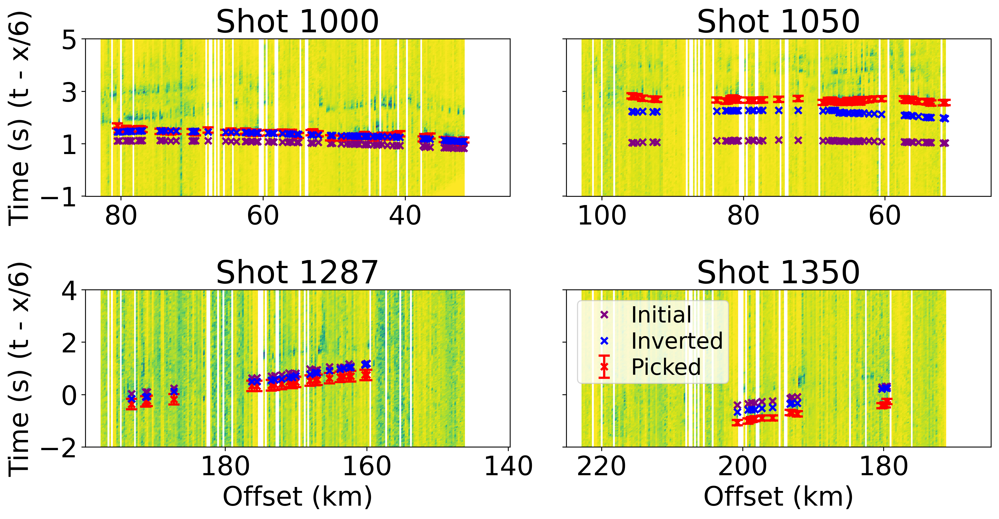
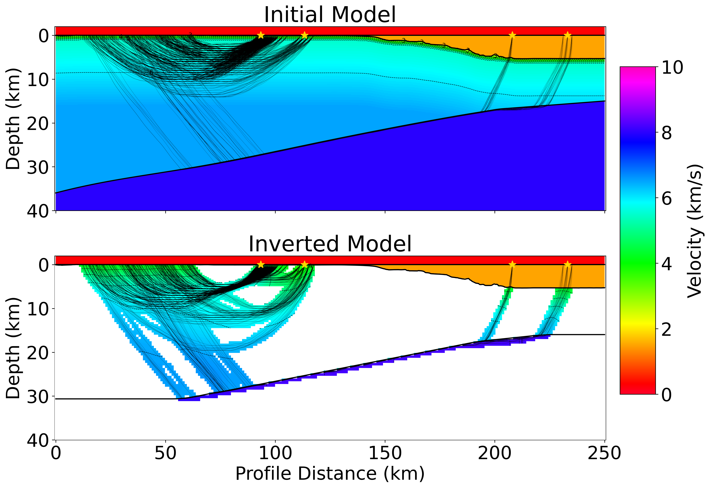

# Investigating Shallow Forearc Structure Within the Southern 1964 MW 9.2 Great Alaska Earthquake Asperity With a Dense Nodal Seismic Array and Marine Airgun Shots #

This repository contains code, data, and figures for my [URISE](https://www.iris.edu/hq/internship/) summer internship project.
My mentor was Professor Lindsay Worthington at University of New Mexico.
I am planning on presenting my results at the Fall 2023 AGU session in San Francisco.

## Abstract ##

We investigate structure of the shallow subduction forearc along a 250 km transect perpendicular to the Aleutian trench offshore of Kodiak Island in southern Alaska. The survey location lies within the southern asperity of the 1964 MW 9.2 Great Alaska Earthquake. The 1964 rupture zone contains along-margin variations in earthquake history, plate structure, sediment input, and plate coupling and is a good location to examine the relationship between structure and seismicity. Specifically, this study aims to characterize the upper plate velocity structure in the accretionary prism and how it compares to structure along-margin. The material properties of the forearc are relevant for understanding earthquake rupture propagation and potential tsunami behavior.

This analysis uses data collected in 2019 as part of the Alaska Amphibious Community Seismic Experiment. The receivers were a dense array of 398 nodal 5 Hz geophones distributed with ~200–300 m spacing along the road network in northeastern Kodiak Island. The source was a 6600 in3 marine airgun array towed by the R/V Marcus Langseth and shot at ~400 m spacing along the study transect offshore.

To obtain first arrivals we applied bandpass and STA/LTA filters. To further improve the signal-to-noise ratio we binned traces by source-receiver offset and stacked adjacent shots within 5 km bins by time-shifting within a velocity range to maximize cross-correlation.

At source-receiver offsets <100 km we observe a first arrival with an apparent velocity of ~6 km/s. Between ~100–180 km, first arrival energy is suppressed and sporadic, likely due to a low velocity zone at depth or a highly attenuating region in the upper plate. At offsets >180 km we observe a first arrival with an apparent velocity of ~8 km/s. At <100 km offsets we also observe a strong reflective phase. The travel times from these seismic phases can be used in ray tracing and inversion to determine velocity structure in the shallow subduction forearc.

## Results ##




## Python environment ##

To build the lock file:
```
conda-lock -f environment.yml
```
To create a Conda environment from the lock file:
```
conda-lock install --name YOUR_ENVIRONMENT_NAME_HERE conda-lock.yml
```

## Stuff to download ##

Can download USGS quaternary faults here: <https://earthquake.usgs.gov/static/lfs/nshm/qfaults/Qfaults_GIS.zip>.
Can find volcanoes for a search range here: <https://www.ngdc.noaa.gov/hazel/view/hazards/volcano/loc-search>.
Can download tectonic plate geometries here: <https://github.com/fraxen/tectonicplates/archive/master.zip>.

## Testing ##

To run all tests run:
```
pytest
```

## Notes ##

1964 rupture traced from Suleimani, E., Nicolsky, D. J., Haeussler, P. J., & Hansen, R. (2011). Combined Effects of Tectonic and Landslide-Generated Tsunami Runup at Seward, Alaska During the M W 9.2 1964 Earthquake. Pure and Applied Geophysics, 168(6–7), 1053–1074. https://doi.org/10.1007/s00024-010-0228-4

All other ruptures traced (and all rupture magnitudes taken) from Liu, C., Lay, T., & Xiong, X. (2022). The 29 July 2021 MW 8.2 Chignik, Alaska Peninsula Earthquake Rupture Inferred From Seismic and Geodetic Observations: Re-Rupture of the Western 2/3 of the 1938 Rupture Zone. Geophysical Research Letters, 49(4), e2021GL096004. https://doi.org/10.1029/2021GL096004

Retrieved ALEUT lines from <https://www.marine-geo.org/tools/search/Events.php?event_set_uid=1329>.

EDGE lines traced from Moore, J. C., Diebold, J., Fisher, M. A., Sample, J., Brocher, T., Talwani, M., et al. (1991). EDGE deep seismic reflection transect of the eastern Aleutian arc-trench layered lower crust reveals underplating and continental growth. Geology, 19(5), 420–424. <https://doi.org/10.1130/0091-7613(1991)019%3c0420:EDSRTO%3e2.3.CO%3b2>

Slab depth contours downloaded from <https://www.sciencebase.gov/catalog/item/5aa2c535e4b0b1c392ea3ca2>.
